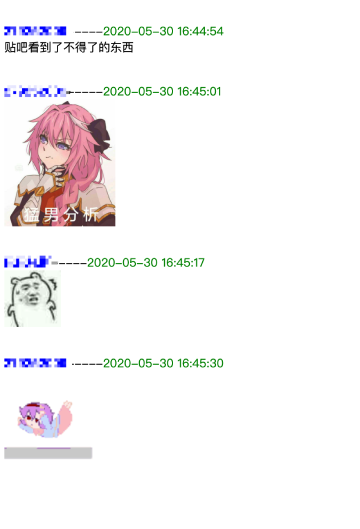

# QQ聊天记录导出

可执行文件[Github下载链接](https://github.com/Yiyiyimu/QQ_History_Backup/releases/download/v2.1/QQ_History_Backup-v2.1.zip)，[百度网盘下载链接](https://pan.baidu.com/s/1zp3Cg724B-Z65eJjGuKHVQ)(86y6) ，可直接运行。

## 简介

作为国内最常用的聊天工具之一，QQ 为了用户留存度，默认聊天记录备份无法脱离 QQ 被独立打开。

目前[版本](#致谢)往往需要自行编译，本方法在之前版本的基础上简化了操作，制作了GUI方便使用；并且不再需要提供密钥，自动填入备注/昵称，添加了QQ表情的一并导出。

## 获取聊天记录文件夹方法

如果root了，直接在以下地址就可以找到。建议压缩文件夹后复制导出。

```
data\data\com.tencent.mobileqq
```

如果没有root，可以通过手机自带的备份工具备份整个QQ软件，具体方法可以参见

> 怎样导出手机中的QQ聊天记录？ - 益新软件的回答 - 知乎
> https://www.zhihu.com/question/28574047/answer/964813560

## GUI使用方法


- com.tencent.mobileqq：选择备份后的相应文件夹，一般为`apps/com.tencent.mobileqq`
- 表情版本：默认为新版QQ表情。如果你的聊天记录来自很早以前（比如我），可以切换为旧版的表情

## 输出截图

为了方便离线查看，qq表情gif选择保存在本地，注意移动聊天记录的时候需要同时移动`emoticon`文件


有bug的话提issue，记得附上log.txt里的内容

## 显示图片

- 需要额外的步骤
- 手机连电脑 adb pull /sdcard/Andoird/data/com.tencent.mobileqq ./
- 或者 找工具把这个路径放到和运行程序同目录 


  
- 注：图片必须在手机上看过一次才有，因为QQ是看了才下载原图

## v2 更新
- 直接从 `files/kc` 提取明文的密钥，不用再手动输入或解密
- 支持群聊记录导出
- 支持 私聊/群聊 的 备注/昵称 自动填入
- 支持 slowtable 的直接整合
- 支持新版 QQ 表情
- 20210120 支持图片

## TODO
- [x] support troop message output
- [x] use com.tencent.mobileqq/f/kc as key
- [x] decode friend/troop name, to use in result
- [x] auto-combine db and slow-table
- [x] update to new qq emoji
- [ ] add desensitization data to create e2e test
- [ ] add Makefile, to run build/test
- [x] use pic in mobile folder, to better present result
- [ ] 支持图片缩略图的加载
- [ ] 支持分享卡片消息
- [ ] 提高图文消息显示兼容性

## 致谢
1. [roadwide/qqmessageoutput](https://github.com/roadwide/qqmessageoutput)
2. [WincerChan/export.py](https://gist.github.com/WincerChan/362331456a6e0417c5aa1cf3ff7be2b7)