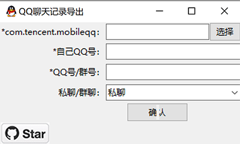

[]()


# QQ聊天记录导出

可执行文件[Github下载链接](https://github.com/Yiyiyimu/QQ_History_Backup/releases/download/v2.2.2/QQ_History_Backup-v2.2.2.zip)，[百度网盘下载链接](https://pan.baidu.com/s/1XQ2cCxCk9cTa05Y94Yos5w)(7uhy) ，可直接运行。

## 简介

作为国内最常用的聊天工具之一，QQ 为了用户留存度，默认聊天记录备份无法脱离 QQ 被独立打开。

目前[版本](#致谢)往往需要自行编译，本方法在之前版本的基础上简化了操作，制作了GUI方便使用；并且不再需要提供密钥，自动填入备注/昵称，添加了QQ表情和图片的一并导出。

## 获取聊天记录文件夹方法

如果手机root，聊天记录可在以下地址找到。因为小文件较多建议压缩文件夹后复制导出。

```
data\data\com.tencent.mobileqq
```

如果没有root，可以通过手机自带的备份工具备份整个QQ，拷贝备份文件到电脑，解压找到 `com.tencent.mobileqq`。

具体方法可以参见

> 怎样导出手机中的QQ聊天记录？ - 益新软件的回答 - 知乎
> https://www.zhihu.com/question/28574047/answer/964813560

如果同时需要在聊天记录中显示图片，拷贝手机中 `Android/data/com.tencent.mobileqq/Tencent/MobileQQ/chatpic/chatimg` 至 `GUI.exe` 同一文件夹中

## GUI使用方法



- com.tencent.mobileqq：选择备份后的相应文件夹，一般为`apps/com.tencent.mobileqq`
- 表情版本：默认为新版QQ表情。如果你的聊天记录来自很早以前（比如我），可以切换为旧版的表情
- 合并图片：默认为否
  - 不启用合并图片好处在于：1. 使导出的 HTML 文件具有可读性；2. 减小 HTML 文件体积方便打开
  - 启用合并图片好处：拷贝时不需要和 `emoticon` 以及 `chatimg` 文件夹一起拷贝，更加方便

## 输出截图


如果没有启用合并图片，拷贝生成的聊天记录时需要一起拷贝 `emoticon` 以及 `chatimg` 文件夹.

有bug的话提issue，记得附上log.txt里的内容。

## v2 更新
- 直接从 `files/kc` 提取明文的密钥，不用再手动输入或解密
- 支持群聊记录导出
- 支持 私聊/群聊 的 备注/昵称 自动填入
- 支持 slowtable 的直接整合
- 支持新版 QQ 表情

## v2.2 更新
- 支持导出图片至聊天记录
- 支持合并图片至单一文件方便传输

## TODO
- [x] support troop message output
- [x] use com.tencent.mobileqq/f/kc as key
- [x] decode friend/troop name, to use in result
- [x] auto-combine db and slow-table
- [x] update to new qq emoji
- [x] use pic in mobile folder, to better present result
- [ ] export voicelines
- [ ] add desensitization data to create e2e test
- [ ] add Makefile, to run build/test
- [ ] support thumbnail images
- [ ] support sharing cards


## FAQ
- **聊天记录中显示 `[图片]` 是因为什么？**

   解码出的图片路径在 `chatimg` 找不到相应文件。可能原因为在手机中没有加载过该文件，导致图片没有存在手机里。

## 致谢
1. [roadwide/qqmessageoutput](https://github.com/roadwide/qqmessageoutput)
2. [WincerChan/export.py](https://gist.github.com/WincerChan/362331456a6e0417c5aa1cf3ff7be2b7)
